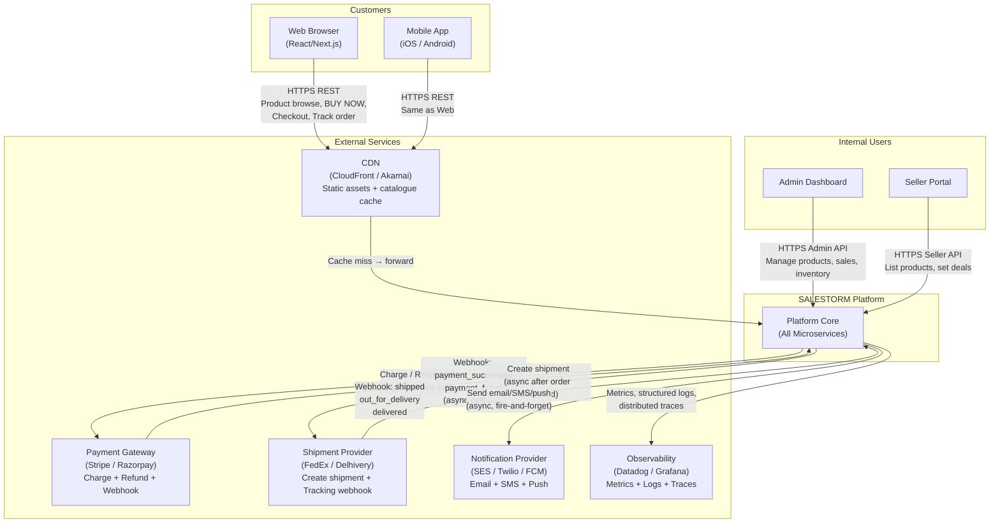

# F. SYSTEM CONTEXT DIAGRAM

## Actors and External Systems

| Actor / System | Role |
|----------------|------|
| Customer (Web/Mobile) | Browses, reserves, pays, tracks |
| Admin | Manages products, sales, inventory |
| Seller | Lists products, manages deals |
| Payment Gateway | Processes charges and refunds |
| Shipment Provider | Handles physical delivery |
| Notification Provider | Sends email/SMS/push |
| Observability Platform | Receives metrics, logs, traces |
| CDN | Serves static assets, caches catalogue |

## System Context Diagram

## Interaction Explanations

### Customer ↔ CDN ↔ Platform
- CDN serves static assets (JS bundles, images) from edge — zero latency.
- CDN caches product catalogue pages with 60-second TTL.
- Dynamic requests (BUY NOW, reserve, pay, order status) always bypass CDN cache
  and reach the platform directly.
- CDN enforces HTTPS; HTTP requests are redirected.

### Admin / Seller ↔ Platform
- Admin and Seller portals bypass CDN and hit the API Gateway directly.
- Elevated JWT roles (ADMIN, SELLER) are required.
- These portals are not on the critical flash-sale path.

### Platform ↔ Payment Gateway
- Payment initiation is a synchronous HTTPS call to the gateway.
- The gateway processes the charge and returns an immediate status.
- For async confirmation (3D Secure, bank redirect), the gateway sends a webhook.
- Webhooks are verified using HMAC signature before processing.

### Platform ↔ Shipment Provider
- Shipment creation is triggered asynchronously after order confirmation.
- The provider sends webhooks for each delivery milestone.
- Webhooks update the SHIPMENT table and trigger customer notifications.

### Platform ↔ Notification Provider
- All notifications are sent asynchronously via Kafka consumer.
- The Notification Service calls the provider's API (SES for email, Twilio for SMS,
  FCM for push).
- Failures are retried with exponential backoff; after 5 retries, moved to DLQ.

### Platform ↔ Observability
- Every service emits structured JSON logs with trace_id, request_id, customer_id.
- Prometheus metrics scraped every 15 seconds.
- OpenTelemetry traces exported to Jaeger/Tempo.
- Alerts fire on: error rate > 1%, P99 latency > 500ms, inventory mismatch detected.
