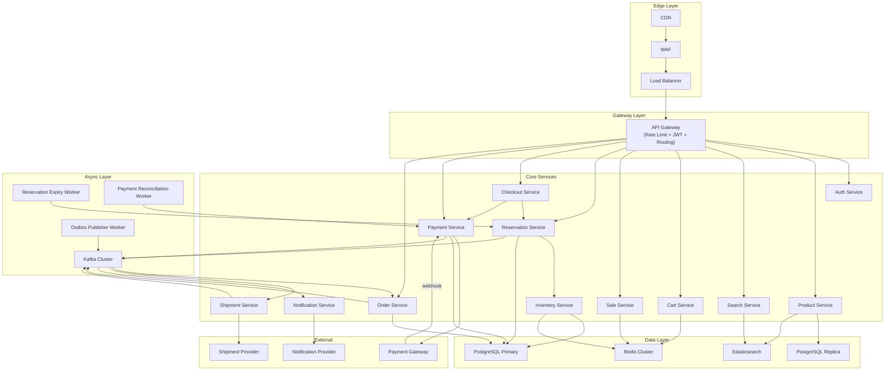
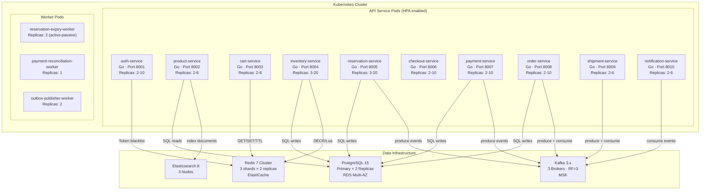
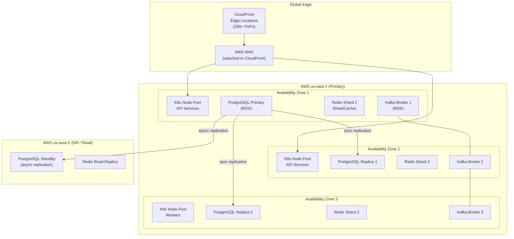

# G. HIGH-LEVEL ARCHITECTURE

## Service Catalogue

| Service | Responsibility | Owns |
|---------|---------------|------|
| CDN | Static assets, catalogue cache | — |
| WAF | Security filtering, rate limiting | — |
| Load Balancer | L7 routing, health checks | — |
| API Gateway | Auth, routing, rate limit, tracing | — |
| Auth Service | JWT issuance, token validation | CUSTOMER |
| Product Service | Product/category CRUD | PRODUCT, CATEGORY |
| Search Service | Full-text search | Elasticsearch index |
| Cart Service | Cart management | CART, CART_ITEM |
| Sale Service | Flash-sale config | SALE, DEAL |
| Inventory Service | Atomic stock control | INVENTORY |
| Reservation Service | Reservation lifecycle | INVENTORY_RESERVATION |
| Checkout Service | Orchestration, pricing | — (stateless) |
| Payment Service | Payment lifecycle | PAYMENT |
| Order Service | Order lifecycle | ORDER, ORDER_ITEM |
| Shipment Service | Shipment tracking | SHIPMENT |
| Notification Service | Email/SMS/push | NOTIFICATION |

## Service Detail

### CDN
- Serves JS, CSS, images from edge nodes globally.
- Caches: product catalogue (TTL 60s), sale landing pages (TTL 30s).
- Does NOT cache: inventory counts, reservation responses, payment responses.
- Terminates TLS at edge.

### WAF
- Blocks: SQL injection, XSS, CSRF, malformed requests.
- Rate limits: 100 req/sec per IP (configurable), 10 BUY NOW/min per user.
- Bot detection: CAPTCHA challenge on suspicious patterns (rapid-fire requests).
- DDoS mitigation: SYN flood protection, connection rate limiting.

### Load Balancer (L7)
- Routes to API Gateway instances (round-robin).
- Health check every 5 seconds; removes unhealthy instances in 10 seconds.
- Sticky sessions NOT used — all services are stateless.
- SSL termination if not done at CDN.

### API Gateway
- Single entry point for all client requests.
- JWT validation (introspects token; checks Redis blacklist for revoked tokens).
- Rate limiting per user (sliding window, stored in Redis).
- Request routing to downstream services.
- Injects X-Request-ID and X-Trace-ID headers.
- Enforces request timeout (30s default).
- Returns 429 on rate limit, 401 on invalid token, 503 on downstream unavailability.

### Auth Service
- Issues JWT access tokens (15-min TTL, RS256 signed).
- Issues refresh tokens (7-day TTL, stored in DB).
- Token revocation: adds jti to Redis blacklist (TTL = remaining token lifetime).
- Passwords hashed with bcrypt (cost factor 12).
- Scaling: stateless, scale horizontally.
- Failure: API Gateway falls back to local JWT signature verification (no revocation check).

### Product Service
- CRUD for products and categories (admin/seller only for writes).
- Reads served from PostgreSQL read replica.
- Publishes ProductUpdated event to Kafka on any change.
- Scaling: read-heavy, scale read replicas.
- Failure: returns stale CDN-cached data for reads; writes fail with 503.

### Search Service
- Elasticsearch-backed full-text search.
- Synced from Product Service via ProductUpdated Kafka events.
- Does NOT own authoritative product data.
- Failure: returns empty results with degraded-mode flag; does not block purchase flow.

### Cart Service
- Cart stored in Redis (TTL 24h) for performance.
- Persisted to PostgreSQL for logged-in users on checkout.
- Soft availability check only — does NOT reserve stock.
- Scaling: stateless, Redis handles state.
- Failure: cart reads fail gracefully; customer can still proceed to BUY NOW.

### Sale Service
- Manages flash-sale configuration (start/end time, discount percentage).
- Validates whether a product is currently on sale.
- Publishes SaleStarted, SaleEnded events.
- Scaling: read-heavy, cache sale config in Redis (TTL 30s).

### Inventory Service
- THE most critical service in the system.
- Owns the INVENTORY table (source of truth for stock).
- Exposes: check availability, reserve (atomic decrement), release, confirm.
- Uses Redis Lua script as fast-rejection gate.
- Uses SQL atomic UPDATE as durable correctness guarantee.
- Never trusts cache for reservation decisions — SQL is always the final authority.
- Scaling: stateless service; DB is the bottleneck, mitigated by Redis gate.
- Failure: if Redis is down, falls back to SQL-only path (slower but correct).

### Reservation Service
- Manages reservation lifecycle (RESERVED → PAYMENT_PENDING → CONFIRMED → SOLD).
- Coordinates with Inventory Service for atomic stock changes.
- Runs expiry worker (scans expired reservations every 30s).
- Publishes ReservationCreated, ReservationExpired, ReservationReleased events.
- Enforces: one active reservation per customer per product.
- Scaling: stateless; DB handles state.

### Checkout Service
- Thin orchestration layer — owns no persistent state.
- Validates reservation is still active.
- Applies coupons (calls Coupon Service).
- Calculates final price.
- Initiates payment (calls Payment Service).
- Scaling: fully stateless, scale horizontally.
- Failure: returns error; reservation remains active for retry.

### Payment Service
- Manages payment lifecycle.
- Calls external Payment Gateway synchronously.
- Receives webhooks from gateway for async confirmation.
- Idempotency enforced via IDEMPOTENCY_RECORD table.
- Publishes PaymentSucceeded, PaymentFailed events to Kafka.
- Uses Outbox pattern: writes payment record + outbox event in one transaction.
- Scaling: stateless; DB handles state.
- Failure: circuit breaker on gateway; reconciliation worker for unresolved payments.

### Order Service
- Consumes PaymentSucceeded events from Kafka.
- Creates ORDER and ORDER_ITEM records.
- Manages order state machine.
- Publishes OrderCreated, OrderConfirmed, OrderShipped, OrderDelivered events.
- Idempotent consumption: checks for existing order with same payment_id before creating.
- Scaling: stateless; Kafka consumer group scales with partitions.
- Failure: Kafka retry ensures order is eventually created even if service is down 30s.

### Shipment Service
- Consumes OrderConfirmed events.
- Calls external Shipment Provider to create shipment.
- Receives delivery webhooks.
- Publishes ShipmentCreated, ShipmentDelivered events.
- Scaling: stateless.

### Notification Service
- Consumes events from all services.
- Sends email/SMS/push via provider APIs.
- At-least-once delivery; idempotent send (tracks notification_id).
- Failure: retry with backoff; DLQ after 5 failures.
- Scaling: Kafka consumer group, scale with partitions.

---

## HLD Diagram

---

## Container Diagram

---

## Deployment Diagram

