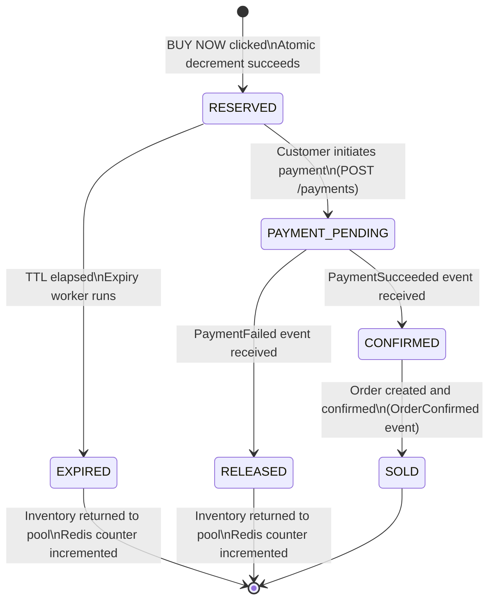

# I. RESERVATION LIFECYCLE

## State Machine



## Reservation Schema (Full)

```sql
CREATE TABLE inventory_reservation (
    reservation_id   UUID         PRIMARY KEY DEFAULT gen_random_uuid(),
    product_id       UUID         NOT NULL REFERENCES product(product_id),
    customer_id      UUID         NOT NULL REFERENCES customer(customer_id),
    sale_id          UUID         NULL     REFERENCES sale(sale_id),
    quantity         INT          NOT NULL CHECK (quantity > 0),
    status           VARCHAR(20)  NOT NULL DEFAULT 'RESERVED'
                                  CHECK (status IN (
                                      'RESERVED','PAYMENT_PENDING',
                                      'CONFIRMED','SOLD',
                                      'RELEASED','EXPIRED'
                                  )),
    expires_at       TIMESTAMPTZ  NOT NULL,
    idempotency_key  VARCHAR(255) NOT NULL,
    version          INT          NOT NULL DEFAULT 1,
    created_at       TIMESTAMPTZ  NOT NULL DEFAULT NOW(),
    updated_at       TIMESTAMPTZ  NOT NULL DEFAULT NOW(),
    released_at      TIMESTAMPTZ  NULL,
    release_reason   VARCHAR(50)  NULL
                                  CHECK (release_reason IN (
                                      'PAYMENT_FAILED','TIMEOUT',
                                      'CANCELLED','ADMIN_RELEASE', NULL
                                  )),
    created_by_ip    INET         NULL,
    payment_id       UUID         NULL REFERENCES payment(payment_id),
    order_id         UUID         NULL REFERENCES "order"(order_id)
);

-- Prevent duplicate active reservations per customer per product
CREATE UNIQUE INDEX uq_active_reservation
    ON inventory_reservation (customer_id, product_id)
    WHERE status IN ('RESERVED', 'PAYMENT_PENDING');

-- Idempotency
CREATE UNIQUE INDEX uq_reservation_idempotency
    ON inventory_reservation (idempotency_key);

-- Expiry worker query index
CREATE INDEX idx_reservation_expiry
    ON inventory_reservation (status, expires_at)
    WHERE status = 'RESERVED';
```

## State Transition Rules

| From | To | Trigger | Actor |
|------|----|---------|-------|
| — | RESERVED | BUY NOW, atomic decrement succeeds | Customer |
| RESERVED | PAYMENT_PENDING | POST /payments called | Customer |
| RESERVED | EXPIRED | expires_at < NOW() | Expiry Worker |
| PAYMENT_PENDING | CONFIRMED | PaymentSucceeded event | Payment Service |
| PAYMENT_PENDING | RELEASED | PaymentFailed event | Payment Service |
| CONFIRMED | SOLD | OrderConfirmed event | Order Service |

**Invalid transitions are rejected at the application layer:**
- SOLD → any state (terminal)
- EXPIRED → any state (terminal)
- RELEASED → any state (terminal)
- CONFIRMED → RELEASED (payment already succeeded)

## Reservation Expiry Worker

```python
# reservation_expiry_worker.py
# Runs every 30 seconds. Safe to run multiple instances.

import psycopg2
import redis
import kafka
import time
import logging

BATCH_SIZE = 100
POLL_INTERVAL_SECONDS = 30

def run_expiry_cycle(db_conn, redis_client, kafka_producer):
    with db_conn.cursor() as cur:
        # FOR UPDATE SKIP LOCKED: two worker instances never process same row
        cur.execute("""
            SELECT reservation_id, product_id, quantity
            FROM inventory_reservation
            WHERE status = 'RESERVED'
              AND expires_at < NOW()
            ORDER BY expires_at ASC
            LIMIT %s
            FOR UPDATE SKIP LOCKED
        """, (BATCH_SIZE,))
        expired = cur.fetchall()

    for (res_id, prod_id, qty) in expired:
        try:
            with db_conn:  # auto-commit/rollback context
                with db_conn.cursor() as cur:
                    # Idempotent guard: only update if still RESERVED
                    cur.execute("""
                        UPDATE inventory_reservation
                        SET status         = 'EXPIRED',
                            released_at    = NOW(),
                            release_reason = 'TIMEOUT',
                            updated_at     = NOW()
                        WHERE reservation_id = %s
                          AND status = 'RESERVED'
                    """, (res_id,))

                    if cur.rowcount == 0:
                        # Already processed by another worker instance
                        continue

                    # Return stock to available pool
                    cur.execute("""
                        UPDATE inventory
                        SET available_quantity = available_quantity + %s,
                            reserved_quantity  = reserved_quantity  - %s,
                            updated_at         = NOW()
                        WHERE product_id = %s
                          AND reserved_quantity >= %s
                    """, (qty, qty, prod_id, qty))

                    if cur.rowcount == 0:
                        # Inventory inconsistency — alert and skip
                        logging.error(
                            "INVENTORY_INCONSISTENCY",
                            extra={"reservation_id": res_id, "product_id": prod_id}
                        )
                        raise Exception("Inventory inconsistency detected")

            # Restore Redis counter (outside transaction — best effort)
            redis_client.incrby(f"inv:{prod_id}", qty)

            # Publish event (outside transaction — Outbox pattern preferred in prod)
            kafka_producer.send("reservation.expired", {
                "reservation_id": str(res_id),
                "product_id":     str(prod_id),
                "quantity":       qty
            })

            logging.info("Reservation expired", extra={"reservation_id": str(res_id)})

        except Exception as e:
            logging.error("Expiry failed", extra={"reservation_id": str(res_id), "error": str(e)})
            # Continue processing other reservations

def main():
    db_conn      = psycopg2.connect(DSN)
    redis_client = redis.Redis(host=REDIS_HOST)
    kafka_prod   = kafka.KafkaProducer(bootstrap_servers=KAFKA_BROKERS)

    while True:
        run_expiry_cycle(db_conn, redis_client, kafka_prod)
        time.sleep(POLL_INTERVAL_SECONDS)
```

## What If the Expiry Worker Runs Twice?

The `AND status = 'RESERVED'` guard in the UPDATE is the idempotency mechanism.

```
Worker Instance 1:
  UPDATE ... WHERE reservation_id = X AND status = 'RESERVED'
  → affected_rows = 1 → proceeds with inventory release

Worker Instance 2 (runs concurrently):
  UPDATE ... WHERE reservation_id = X AND status = 'RESERVED'
  → affected_rows = 0 (status is now 'EXPIRED') → skips
```

`FOR UPDATE SKIP LOCKED` prevents both instances from even selecting the same row
in the first place. The `AND status = 'RESERVED'` guard is a second safety net.

**Result: Inventory is released exactly once, regardless of how many worker
instances run.**

## Redis Counter Restoration

After the DB transaction commits, the Redis counter is incremented:
```
INCRBY inv:{product_id} {quantity}
```

This is done outside the DB transaction (best-effort). If Redis is temporarily
unavailable, the counter will be restored when Redis is rebuilt from the DB
(reconciliation worker runs every 5 minutes and syncs Redis counters from
`available_quantity` in the inventory table).

## Reservation Lifecycle Events

| Event | Trigger | Consumers |
|-------|---------|-----------|
| ReservationCreated | Reservation inserted | Notification Service |
| ReservationExpired | Expiry worker | Notification Service, Analytics |
| ReservationReleased | Payment failed | Notification Service |
| ReservationConfirmed | Payment succeeded | Order Service |
| ReservationSold | Order confirmed | Analytics |
