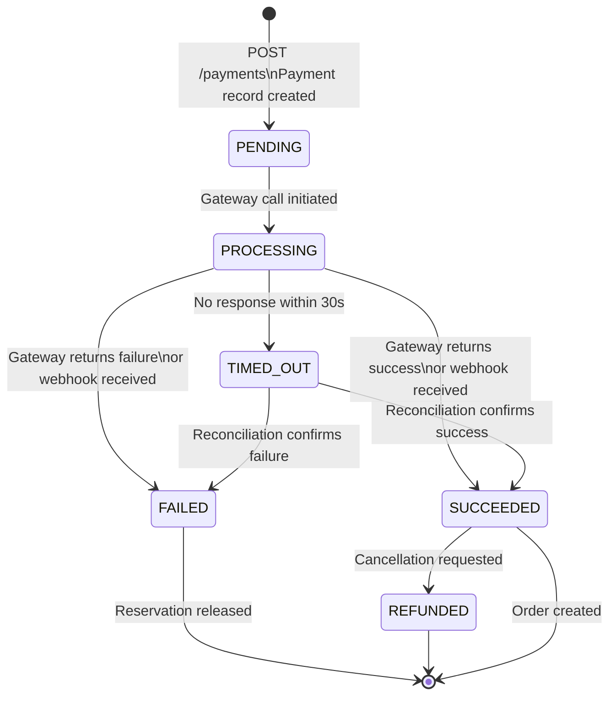

# K. PAYMENT ARCHITECTURE

## Design Goals

1. Never charge a customer twice.
2. Never lose a successful payment.
3. Handle all failure modes gracefully.
4. Ensure order is always created after successful payment.

---

## Payment State Machine



---

## Payment Flow (Happy Path)

```
1. Client: POST /payments
   Headers: Idempotency-Key: KEY-2
   Body: { reservation_id, amount, currency, payment_method }

2. Payment Service:
   a. Check idempotency cache → not found
   b. Validate reservation is RESERVED or PAYMENT_PENDING
   c. Generate payment_reference = UUID (sent to gateway as idempotency key)
   d. BEGIN TRANSACTION
      INSERT INTO payment (payment_id, reservation_id, amount, status='PENDING',
                           payment_reference, idempotency_key)
      UPDATE inventory_reservation SET status='PAYMENT_PENDING'
      INSERT INTO outbox_event (event_type='PaymentInitiated', payload=...)
   e. COMMIT

3. Payment Service calls Gateway:
   POST https://gateway.com/charge
   { payment_reference, amount, currency, payment_method_token }

4. Gateway returns: { status: 'succeeded', gateway_transaction_id }

5. Payment Service:
   BEGIN TRANSACTION
     UPDATE payment SET status='SUCCEEDED', gateway_transaction_id=...
     INSERT INTO outbox_event (event_type='PaymentSucceeded', payload=...)
   COMMIT

6. Outbox Worker publishes PaymentSucceeded to Kafka

7. Order Service consumes PaymentSucceeded → creates order
```

---

## All 8 Failure Cases

### Case 1: Payment Succeeds
Normal flow above. PaymentSucceeded event → Order created.

### Case 2: Payment Fails

```
Gateway returns: { status: 'failed', reason: 'insufficient_funds' }

Payment Service:
  BEGIN TRANSACTION
    UPDATE payment SET status='FAILED'
    UPDATE inventory_reservation SET status='RELEASED', release_reason='PAYMENT_FAILED'
    UPDATE inventory SET available_quantity += qty, reserved_quantity -= qty
    INSERT INTO outbox_event (event_type='PaymentFailed')
  COMMIT

Redis: INCRBY inv:{product_id} {qty}

Outbox Worker publishes PaymentFailed to Kafka
Notification Service sends "Payment failed" email
```

### Case 3: Payment Times Out

```
Gateway call exceeds 30-second timeout.

Payment Service:
  UPDATE payment SET status='TIMED_OUT'
  Do NOT release reservation yet (payment may have succeeded at gateway)

Reconciliation Worker (runs every 60s):
  SELECT * FROM payment WHERE status = 'TIMED_OUT' AND updated_at < NOW() - INTERVAL '2 min'
  For each: call gateway status API with payment_reference
    → If succeeded: update to SUCCEEDED, publish PaymentSucceeded
    → If failed:    update to FAILED, release reservation
    → If pending:   wait for next reconciliation cycle
```

### Case 4: Customer Retries Payment

```
Client retries with same Idempotency-Key:
  → Idempotency cache hit → return original response (no reprocessing)

Client retries with new Idempotency-Key (new attempt):
  → Check: existing payment for this reservation_id with status SUCCEEDED?
    → Yes: return 409 ALREADY_PAID
    → No: proceed with new payment attempt
  → Check: reservation still active (not expired)?
    → No: return 409 RESERVATION_EXPIRED
    → Yes: proceed
```

### Case 5: Payment Succeeds but Response Is Lost

```
Gateway charges customer.
Network drops before response reaches Payment Service.
Payment Service sees timeout.

Payment Service: status = TIMED_OUT

Reconciliation Worker:
  Calls gateway: GET /payments/{payment_reference}/status
  Gateway returns: { status: 'succeeded' }
  Payment Service: UPDATE payment SET status='SUCCEEDED'
  Publishes PaymentSucceeded
  Order Service creates order

Customer is NOT charged again because:
  - payment_reference is the same UUID
  - Gateway deduplicates on payment_reference
  - We never call gateway.charge() again for a TIMED_OUT payment
    (we only call gateway.status())
```

### Case 6: Payment Succeeds but Order Service Is Down 30 Seconds

**This is the most critical failure scenario. See Section M for full detail.**

```
Payment Service:
  1. Writes PaymentSucceeded to OUTBOX_EVENT table (same transaction as payment update)
  2. Returns 200 to customer

Outbox Worker:
  3. Reads OUTBOX_EVENT, publishes to Kafka topic "payment.succeeded"
  4. Kafka retains message for 7 days

Order Service (comes back online after 30s):
  5. Kafka consumer resumes from last committed offset
  6. Consumes PaymentSucceeded event
  7. Checks: SELECT FROM "order" WHERE payment_id = ? → not found
  8. Creates order
  9. Commits Kafka offset

Result: Order is created. Customer is not charged again. No data lost.
```

### Case 7: Duplicate Payment Request

```
Two requests arrive with different Idempotency-Keys but same reservation_id.

First request:
  → Creates payment record, calls gateway, succeeds

Second request (different Idempotency-Key):
  → Idempotency check: not found (different key)
  → Business check: SELECT FROM payment WHERE reservation_id = ? AND status = 'SUCCEEDED'
  → Found: return 409 ALREADY_PAID
  → Gateway is NEVER called again

Customer is charged exactly once.
```

### Case 8: Payment Gateway Completely Unavailable

```
Circuit Breaker state: CLOSED → OPEN after 5 failures in 10 seconds

While OPEN:
  All payment requests immediately return 503 SERVICE_UNAVAILABLE
  No gateway calls attempted
  Reservations remain active (customer can retry later)

After 30 seconds: Circuit Breaker moves to HALF_OPEN
  One test request allowed through
  If succeeds: CLOSED (normal operation resumes)
  If fails: back to OPEN

Customer-visible result:
  "Payment service temporarily unavailable. Your reservation is held for 10 minutes.
   Please try again."
```

---

## Outbox Pattern for Payment → Order Reliability

```sql
-- Written in same transaction as payment update
INSERT INTO outbox_event (
    event_id,
    aggregate_type,
    aggregate_id,
    event_type,
    payload,
    status,
    created_at
) VALUES (
    gen_random_uuid(),
    'payment',
    :payment_id,
    'PaymentSucceeded',
    :json_payload,
    'PENDING',
    NOW()
);
```

```python
# outbox_publisher_worker.py
# Polls OUTBOX_EVENT table and publishes to Kafka

def publish_pending_events(db, kafka_producer):
    events = db.query("""
        SELECT event_id, event_type, payload
        FROM outbox_event
        WHERE status = 'PENDING'
        ORDER BY created_at ASC
        LIMIT 100
        FOR UPDATE SKIP LOCKED
    """)

    for event in events:
        kafka_producer.send(
            topic=event_type_to_topic(event.event_type),
            key=event.aggregate_id,
            value=event.payload
        )
        db.execute("""
            UPDATE outbox_event
            SET status = 'PUBLISHED', published_at = NOW()
            WHERE event_id = %s
        """, event.event_id)
        db.commit()
```

**Why Outbox?**
Without Outbox: Payment DB update and Kafka publish are two separate operations.
If Kafka publish fails after DB commit, the event is lost forever.

With Outbox: Both the payment update and the event record are in the same DB
transaction. The Outbox Worker reliably publishes the event. Even if the worker
crashes, it restarts and publishes from the last PENDING event.

---

## Payment Protection Summary

| Threat | Protection |
|--------|-----------|
| Duplicate charge (same request) | Idempotency-Key cache + DB record |
| Duplicate charge (retry) | payment_reference UNIQUE at gateway |
| Lost payment (network drop) | Reconciliation worker queries gateway status |
| Lost payment (Order Service down) | Outbox pattern + Kafka retention |
| Gateway unavailable | Circuit breaker + reservation held |
| Timeout ambiguity | TIMED_OUT status + reconciliation |
