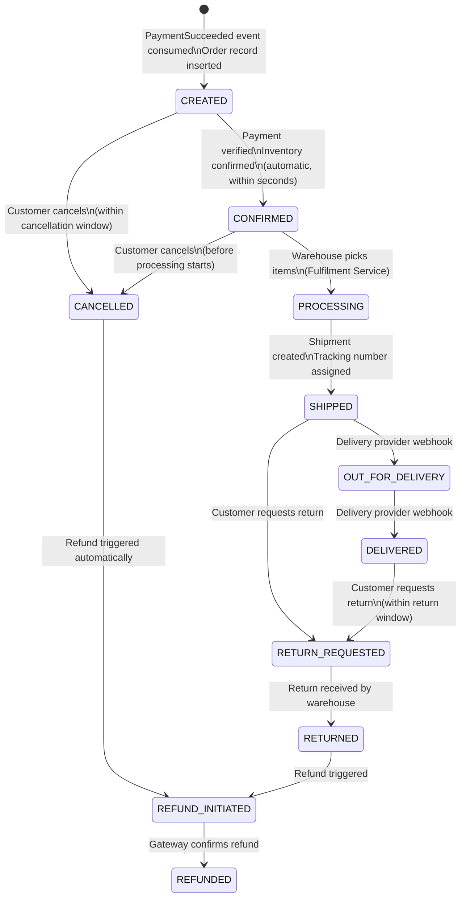

# L. ORDER MANAGEMENT

## Order State Machine



## State Transition Rules

| Transition | Trigger | Actor | Allowed? |
|------------|---------|-------|---------|
| → CREATED | PaymentSucceeded event | Order Service (auto) | Always |
| CREATED → CONFIRMED | Payment verified | Order Service (auto) | Always |
| CONFIRMED → PROCESSING | Warehouse picks | Fulfilment Service | Always |
| PROCESSING → SHIPPED | Shipment created | Shipment Service | Always |
| SHIPPED → OUT_FOR_DELIVERY | Delivery webhook | Shipment Service | Always |
| OUT_FOR_DELIVERY → DELIVERED | Delivery webhook | Shipment Service | Always |
| CREATED → CANCELLED | Customer request | Customer | Within 1 hour |
| CONFIRMED → CANCELLED | Customer request | Customer | Before PROCESSING |
| PROCESSING → CANCELLED | Customer request | Customer | NOT ALLOWED |
| SHIPPED → CANCELLED | Customer request | Customer | NOT ALLOWED |
| Any → CANCELLED | Admin override | Admin | Always |

## Invalid Transitions

The Order Service enforces a state machine. Any attempt to transition to an
invalid state returns HTTP 422 INVALID_STATE_TRANSITION.

```
DELIVERED → CONFIRMED  ← REJECTED
SHIPPED → CREATED      ← REJECTED
CANCELLED → CONFIRMED  ← REJECTED
```

## Order Schema

```sql
CREATE TABLE "order" (
    order_id         UUID         PRIMARY KEY DEFAULT gen_random_uuid(),
    customer_id      UUID         NOT NULL REFERENCES customer(customer_id),
    reservation_id   UUID         NOT NULL REFERENCES inventory_reservation(reservation_id),
    payment_id       UUID         NOT NULL REFERENCES payment(payment_id),
    status           VARCHAR(25)  NOT NULL DEFAULT 'CREATED'
                                  CHECK (status IN (
                                      'CREATED','CONFIRMED','PROCESSING',
                                      'SHIPPED','OUT_FOR_DELIVERY','DELIVERED',
                                      'CANCELLED','REFUND_INITIATED','REFUNDED',
                                      'RETURN_REQUESTED','RETURNED'
                                  )),
    total_amount     NUMERIC(12,2) NOT NULL,
    currency         CHAR(3)      NOT NULL DEFAULT 'USD',
    shipping_address JSONB        NOT NULL,
    coupon_code      VARCHAR(50)  NULL,
    discount_amount  NUMERIC(12,2) NOT NULL DEFAULT 0,
    version          INT          NOT NULL DEFAULT 1,
    created_at       TIMESTAMPTZ  NOT NULL DEFAULT NOW(),
    updated_at       TIMESTAMPTZ  NOT NULL DEFAULT NOW(),
    cancelled_at     TIMESTAMPTZ  NULL,
    cancel_reason    VARCHAR(100) NULL,
    delivered_at     TIMESTAMPTZ  NULL
);

-- Prevent duplicate orders for same payment
CREATE UNIQUE INDEX uq_order_payment ON "order" (payment_id);

CREATE INDEX idx_order_customer ON "order" (customer_id, created_at DESC);
CREATE INDEX idx_order_status   ON "order" (status, updated_at);
```

## Order Item Schema

```sql
CREATE TABLE order_item (
    order_item_id  UUID          PRIMARY KEY DEFAULT gen_random_uuid(),
    order_id       UUID          NOT NULL REFERENCES "order"(order_id),
    product_id     UUID          NOT NULL REFERENCES product(product_id),
    quantity       INT           NOT NULL CHECK (quantity > 0),
    unit_price     NUMERIC(12,2) NOT NULL,
    total_price    NUMERIC(12,2) NOT NULL,
    created_at     TIMESTAMPTZ   NOT NULL DEFAULT NOW()
);

CREATE INDEX idx_order_item_order ON order_item (order_id);
```

## Order Creation (Idempotent)

```python
# order_service/consumer.py

def handle_payment_succeeded(event):
    payment_id = event['payment_id']

    # Idempotency check — natural key is payment_id
    existing = db.query(
        "SELECT order_id FROM \"order\" WHERE payment_id = %s",
        payment_id
    )
    if existing:
        logger.info("Order already exists for payment", payment_id=payment_id)
        return  # Acknowledge Kafka message, skip processing

    with db.transaction():
        order_id = uuid4()
        db.execute("""
            INSERT INTO "order" (
                order_id, customer_id, reservation_id, payment_id,
                status, total_amount, currency, shipping_address
            ) VALUES (%s, %s, %s, %s, 'CREATED', %s, %s, %s)
        """, order_id, event['customer_id'], event['reservation_id'],
             payment_id, event['amount'], event['currency'], event['shipping_address'])

        # Insert order items
        for item in event['items']:
            db.execute("""
                INSERT INTO order_item (order_id, product_id, quantity, unit_price, total_price)
                VALUES (%s, %s, %s, %s, %s)
            """, order_id, item['product_id'], item['quantity'],
                 item['unit_price'], item['total_price'])

        # Update reservation to CONFIRMED
        db.execute("""
            UPDATE inventory_reservation
            SET status = 'CONFIRMED', order_id = %s, updated_at = NOW()
            WHERE reservation_id = %s AND status = 'PAYMENT_PENDING'
        """, order_id, event['reservation_id'])

        # Publish OrderCreated event via outbox
        db.execute("""
            INSERT INTO outbox_event (event_type, aggregate_id, payload)
            VALUES ('OrderCreated', %s, %s)
        """, order_id, json.dumps(event))
```

## Cancellation Flow

```
Customer: POST /orders/{order_id}/cancel

Order Service:
  1. Validate order is in CREATED or CONFIRMED state
  2. BEGIN TRANSACTION
     UPDATE "order" SET status='CANCELLED', cancelled_at=NOW(), cancel_reason=...
     UPDATE inventory_reservation SET status='RELEASED', release_reason='CANCELLED'
     UPDATE inventory SET available_quantity += qty, reserved_quantity -= qty
     INSERT INTO outbox_event (event_type='OrderCancelled')
  3. COMMIT
  4. Outbox Worker publishes OrderCancelled
  5. Payment Service consumes OrderCancelled → initiates refund
  6. Redis: INCRBY inv:{product_id} {qty}
```

## Recovery: Order Creation Failure

If Order Service crashes after consuming PaymentSucceeded but before committing:
- Kafka offset was NOT committed (consumer crashed before ack).
- On restart, Kafka redelivers the message.
- Order Service checks `payment_id` → no order found → creates order.
- Idempotent: safe to process the same event multiple times.

If Order Service crashes after creating order but before committing Kafka offset:
- Kafka redelivers the message.
- Order Service checks `payment_id` → order found → skips creation.
- Idempotent: no duplicate order.
