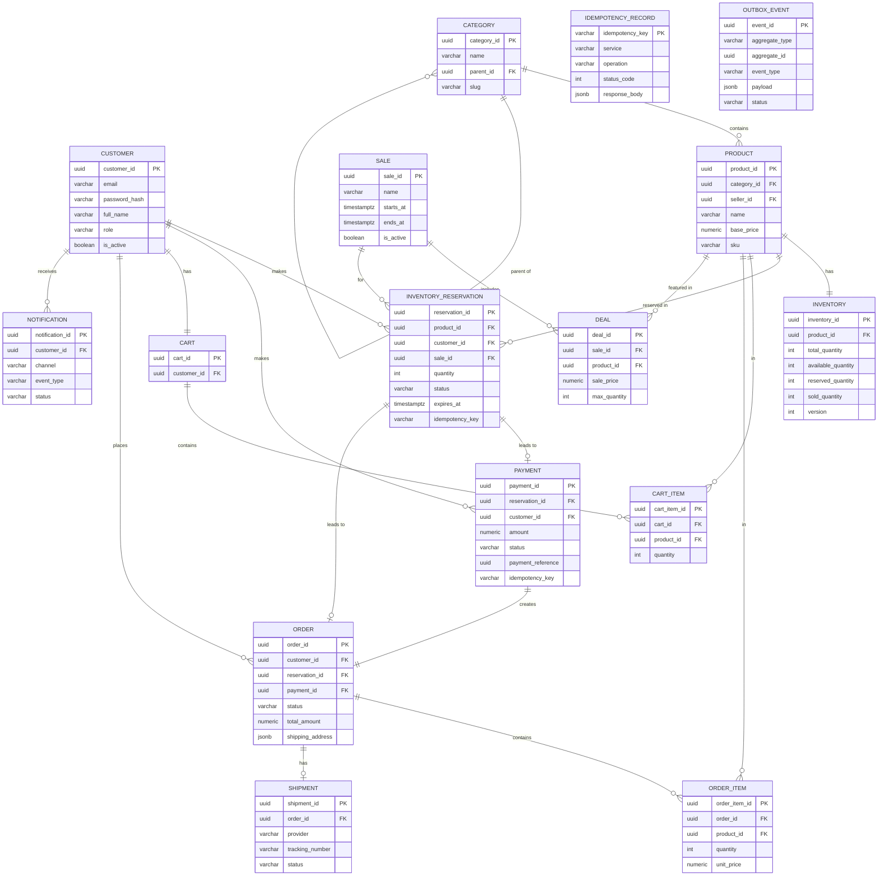

# N. DATABASE DESIGN

## Design Principles

- PostgreSQL 15 as the primary relational database.
- All financial data (payment, order) uses NUMERIC(12,2) — never FLOAT.
- All primary keys are UUID (gen_random_uuid()) — avoids sequential ID enumeration.
- All tables have created_at and updated_at timestamps.
- Soft deletes where appropriate (is_deleted flag) — hard deletes only for GDPR.
- Isolation level: READ COMMITTED (default) for most operations.
- Inventory UPDATE uses implicit row-level locking (no explicit FOR UPDATE needed).
- Outbox events use FOR UPDATE SKIP LOCKED for concurrent workers.

---

## Complete Schema

```sql
-- ============================================================
-- CUSTOMER
-- ============================================================
CREATE TABLE customer (
    customer_id    UUID         PRIMARY KEY DEFAULT gen_random_uuid(),
    email          VARCHAR(255) NOT NULL,
    password_hash  VARCHAR(255) NOT NULL,
    full_name      VARCHAR(255) NOT NULL,
    phone          VARCHAR(20)  NULL,
    role           VARCHAR(20)  NOT NULL DEFAULT 'CUSTOMER'
                                CHECK (role IN ('CUSTOMER','ADMIN','SELLER')),
    is_active      BOOLEAN      NOT NULL DEFAULT TRUE,
    created_at     TIMESTAMPTZ  NOT NULL DEFAULT NOW(),
    updated_at     TIMESTAMPTZ  NOT NULL DEFAULT NOW()
);
CREATE UNIQUE INDEX uq_customer_email ON customer (LOWER(email));
CREATE INDEX idx_customer_role ON customer (role);

-- ============================================================
-- CATEGORY
-- ============================================================
CREATE TABLE category (
    category_id   UUID         PRIMARY KEY DEFAULT gen_random_uuid(),
    name          VARCHAR(100) NOT NULL,
    parent_id     UUID         NULL REFERENCES category(category_id),
    slug          VARCHAR(100) NOT NULL,
    created_at    TIMESTAMPTZ  NOT NULL DEFAULT NOW()
);
CREATE UNIQUE INDEX uq_category_slug ON category (slug);

-- ============================================================
-- PRODUCT
-- ============================================================
CREATE TABLE product (
    product_id    UUID          PRIMARY KEY DEFAULT gen_random_uuid(),
    category_id   UUID          NOT NULL REFERENCES category(category_id),
    seller_id     UUID          NOT NULL REFERENCES customer(customer_id),
    name          VARCHAR(255)  NOT NULL,
    description   TEXT          NULL,
    base_price    NUMERIC(12,2) NOT NULL CHECK (base_price >= 0),
    sku           VARCHAR(100)  NOT NULL,
    is_active     BOOLEAN       NOT NULL DEFAULT TRUE,
    created_at    TIMESTAMPTZ   NOT NULL DEFAULT NOW(),
    updated_at    TIMESTAMPTZ   NOT NULL DEFAULT NOW()
);
CREATE UNIQUE INDEX uq_product_sku ON product (sku);
CREATE INDEX idx_product_category ON product (category_id);
CREATE INDEX idx_product_seller   ON product (seller_id);

-- ============================================================
-- INVENTORY
-- ============================================================
CREATE TABLE inventory (
    inventory_id       UUID  PRIMARY KEY DEFAULT gen_random_uuid(),
    product_id         UUID  NOT NULL REFERENCES product(product_id),
    total_quantity     INT   NOT NULL CHECK (total_quantity >= 0),
    available_quantity INT   NOT NULL CHECK (available_quantity >= 0),
    reserved_quantity  INT   NOT NULL CHECK (reserved_quantity >= 0),
    sold_quantity      INT   NOT NULL DEFAULT 0 CHECK (sold_quantity >= 0),
    version            INT   NOT NULL DEFAULT 1,
    updated_at         TIMESTAMPTZ NOT NULL DEFAULT NOW(),
    -- Invariant: available + reserved + sold = total
    CONSTRAINT chk_inventory_sum
        CHECK (available_quantity + reserved_quantity + sold_quantity = total_quantity)
);
CREATE UNIQUE INDEX uq_inventory_product ON inventory (product_id);

-- ============================================================
-- INVENTORY_RESERVATION
-- ============================================================
CREATE TABLE inventory_reservation (
    reservation_id   UUID         PRIMARY KEY DEFAULT gen_random_uuid(),
    product_id       UUID         NOT NULL REFERENCES product(product_id),
    customer_id      UUID         NOT NULL REFERENCES customer(customer_id),
    sale_id          UUID         NULL,
    quantity         INT          NOT NULL CHECK (quantity > 0),
    status           VARCHAR(20)  NOT NULL DEFAULT 'RESERVED'
                                  CHECK (status IN (
                                      'RESERVED','PAYMENT_PENDING',
                                      'CONFIRMED','SOLD',
                                      'RELEASED','EXPIRED'
                                  )),
    expires_at       TIMESTAMPTZ  NOT NULL,
    idempotency_key  VARCHAR(255) NOT NULL,
    version          INT          NOT NULL DEFAULT 1,
    created_at       TIMESTAMPTZ  NOT NULL DEFAULT NOW(),
    updated_at       TIMESTAMPTZ  NOT NULL DEFAULT NOW(),
    released_at      TIMESTAMPTZ  NULL,
    release_reason   VARCHAR(50)  NULL,
    created_by_ip    INET         NULL,
    payment_id       UUID         NULL,
    order_id         UUID         NULL
);
CREATE UNIQUE INDEX uq_reservation_idempotency
    ON inventory_reservation (idempotency_key);
CREATE UNIQUE INDEX uq_active_reservation
    ON inventory_reservation (customer_id, product_id)
    WHERE status IN ('RESERVED', 'PAYMENT_PENDING');
CREATE INDEX idx_reservation_expiry
    ON inventory_reservation (status, expires_at)
    WHERE status = 'RESERVED';
CREATE INDEX idx_reservation_customer
    ON inventory_reservation (customer_id, created_at DESC);

-- ============================================================
-- CART
-- ============================================================
CREATE TABLE cart (
    cart_id     UUID        PRIMARY KEY DEFAULT gen_random_uuid(),
    customer_id UUID        NOT NULL REFERENCES customer(customer_id),
    created_at  TIMESTAMPTZ NOT NULL DEFAULT NOW(),
    updated_at  TIMESTAMPTZ NOT NULL DEFAULT NOW()
);
CREATE UNIQUE INDEX uq_cart_customer ON cart (customer_id);

-- ============================================================
-- CART_ITEM
-- ============================================================
CREATE TABLE cart_item (
    cart_item_id UUID          PRIMARY KEY DEFAULT gen_random_uuid(),
    cart_id      UUID          NOT NULL REFERENCES cart(cart_id) ON DELETE CASCADE,
    product_id   UUID          NOT NULL REFERENCES product(product_id),
    quantity     INT           NOT NULL CHECK (quantity > 0),
    added_at     TIMESTAMPTZ   NOT NULL DEFAULT NOW()
);
CREATE UNIQUE INDEX uq_cart_item ON cart_item (cart_id, product_id);

-- ============================================================
-- SALE
-- ============================================================
CREATE TABLE sale (
    sale_id      UUID          PRIMARY KEY DEFAULT gen_random_uuid(),
    name         VARCHAR(255)  NOT NULL,
    starts_at    TIMESTAMPTZ   NOT NULL,
    ends_at      TIMESTAMPTZ   NOT NULL,
    is_active    BOOLEAN       NOT NULL DEFAULT FALSE,
    created_by   UUID          NOT NULL REFERENCES customer(customer_id),
    created_at   TIMESTAMPTZ   NOT NULL DEFAULT NOW(),
    CONSTRAINT chk_sale_dates CHECK (ends_at > starts_at)
);
CREATE INDEX idx_sale_active ON sale (is_active, starts_at, ends_at);

-- ============================================================
-- DEAL (product in a sale)
-- ============================================================
CREATE TABLE deal (
    deal_id          UUID          PRIMARY KEY DEFAULT gen_random_uuid(),
    sale_id          UUID          NOT NULL REFERENCES sale(sale_id),
    product_id       UUID          NOT NULL REFERENCES product(product_id),
    sale_price       NUMERIC(12,2) NOT NULL CHECK (sale_price >= 0),
    max_quantity     INT           NOT NULL CHECK (max_quantity > 0),
    per_customer_limit INT         NOT NULL DEFAULT 1 CHECK (per_customer_limit > 0),
    created_at       TIMESTAMPTZ   NOT NULL DEFAULT NOW()
);
CREATE UNIQUE INDEX uq_deal_sale_product ON deal (sale_id, product_id);

-- ============================================================
-- COUPON
-- ============================================================
CREATE TABLE coupon (
    coupon_id        UUID          PRIMARY KEY DEFAULT gen_random_uuid(),
    code             VARCHAR(50)   NOT NULL,
    discount_type    VARCHAR(10)   NOT NULL CHECK (discount_type IN ('PERCENT','FIXED')),
    discount_value   NUMERIC(12,2) NOT NULL CHECK (discount_value > 0),
    max_uses         INT           NULL,
    used_count       INT           NOT NULL DEFAULT 0,
    expires_at       TIMESTAMPTZ   NULL,
    is_active        BOOLEAN       NOT NULL DEFAULT TRUE,
    created_at       TIMESTAMPTZ   NOT NULL DEFAULT NOW()
);
CREATE UNIQUE INDEX uq_coupon_code ON coupon (UPPER(code));

-- ============================================================
-- PAYMENT
-- ============================================================
CREATE TABLE payment (
    payment_id           UUID          PRIMARY KEY DEFAULT gen_random_uuid(),
    reservation_id       UUID          NOT NULL REFERENCES inventory_reservation(reservation_id),
    customer_id          UUID          NOT NULL REFERENCES customer(customer_id),
    amount               NUMERIC(12,2) NOT NULL CHECK (amount > 0),
    currency             CHAR(3)       NOT NULL DEFAULT 'USD',
    status               VARCHAR(20)   NOT NULL DEFAULT 'PENDING'
                                       CHECK (status IN (
                                           'PENDING','PROCESSING','SUCCEEDED',
                                           'FAILED','TIMED_OUT','REFUNDED'
                                       )),
    payment_method       VARCHAR(50)   NOT NULL,
    payment_reference    UUID          NOT NULL,  -- sent to gateway as idempotency key
    gateway_txn_id       VARCHAR(255)  NULL,
    idempotency_key      VARCHAR(255)  NOT NULL,
    failure_reason       VARCHAR(255)  NULL,
    created_at           TIMESTAMPTZ   NOT NULL DEFAULT NOW(),
    updated_at           TIMESTAMPTZ   NOT NULL DEFAULT NOW(),
    succeeded_at         TIMESTAMPTZ   NULL,
    refunded_at          TIMESTAMPTZ   NULL
);
CREATE UNIQUE INDEX uq_payment_reference    ON payment (payment_reference);
CREATE UNIQUE INDEX uq_payment_idempotency  ON payment (idempotency_key);
CREATE INDEX idx_payment_reservation        ON payment (reservation_id);
CREATE INDEX idx_payment_status_updated     ON payment (status, updated_at)
    WHERE status IN ('PENDING','PROCESSING','TIMED_OUT');

-- ============================================================
-- ORDER
-- ============================================================
CREATE TABLE "order" (
    order_id         UUID          PRIMARY KEY DEFAULT gen_random_uuid(),
    customer_id      UUID          NOT NULL REFERENCES customer(customer_id),
    reservation_id   UUID          NOT NULL REFERENCES inventory_reservation(reservation_id),
    payment_id       UUID          NOT NULL REFERENCES payment(payment_id),
    status           VARCHAR(25)   NOT NULL DEFAULT 'CREATED'
                                   CHECK (status IN (
                                       'CREATED','CONFIRMED','PROCESSING',
                                       'SHIPPED','OUT_FOR_DELIVERY','DELIVERED',
                                       'CANCELLED','REFUND_INITIATED','REFUNDED',
                                       'RETURN_REQUESTED','RETURNED'
                                   )),
    total_amount     NUMERIC(12,2) NOT NULL,
    currency         CHAR(3)       NOT NULL DEFAULT 'USD',
    shipping_address JSONB         NOT NULL,
    coupon_code      VARCHAR(50)   NULL,
    discount_amount  NUMERIC(12,2) NOT NULL DEFAULT 0,
    version          INT           NOT NULL DEFAULT 1,
    created_at       TIMESTAMPTZ   NOT NULL DEFAULT NOW(),
    updated_at       TIMESTAMPTZ   NOT NULL DEFAULT NOW(),
    cancelled_at     TIMESTAMPTZ   NULL,
    cancel_reason    VARCHAR(100)  NULL,
    delivered_at     TIMESTAMPTZ   NULL
);
CREATE UNIQUE INDEX uq_order_payment      ON "order" (payment_id);
CREATE UNIQUE INDEX uq_order_reservation  ON "order" (reservation_id);
CREATE INDEX idx_order_customer           ON "order" (customer_id, created_at DESC);
CREATE INDEX idx_order_status             ON "order" (status, updated_at);

-- ============================================================
-- ORDER_ITEM
-- ============================================================
CREATE TABLE order_item (
    order_item_id  UUID          PRIMARY KEY DEFAULT gen_random_uuid(),
    order_id       UUID          NOT NULL REFERENCES "order"(order_id),
    product_id     UUID          NOT NULL REFERENCES product(product_id),
    quantity       INT           NOT NULL CHECK (quantity > 0),
    unit_price     NUMERIC(12,2) NOT NULL,
    total_price    NUMERIC(12,2) NOT NULL,
    created_at     TIMESTAMPTZ   NOT NULL DEFAULT NOW()
);
CREATE INDEX idx_order_item_order ON order_item (order_id);

-- ============================================================
-- SHIPMENT
-- ============================================================
CREATE TABLE shipment (
    shipment_id      UUID         PRIMARY KEY DEFAULT gen_random_uuid(),
    order_id         UUID         NOT NULL REFERENCES "order"(order_id),
    provider         VARCHAR(50)  NOT NULL,
    tracking_number  VARCHAR(100) NULL,
    status           VARCHAR(30)  NOT NULL DEFAULT 'PENDING'
                                  CHECK (status IN (
                                      'PENDING','CREATED','PICKED_UP',
                                      'IN_TRANSIT','OUT_FOR_DELIVERY',
                                      'DELIVERED','FAILED'
                                  )),
    estimated_delivery TIMESTAMPTZ NULL,
    delivered_at     TIMESTAMPTZ  NULL,
    created_at       TIMESTAMPTZ  NOT NULL DEFAULT NOW(),
    updated_at       TIMESTAMPTZ  NOT NULL DEFAULT NOW()
);
CREATE UNIQUE INDEX uq_shipment_order ON shipment (order_id);
CREATE INDEX idx_shipment_tracking ON shipment (tracking_number);

-- ============================================================
-- NOTIFICATION
-- ============================================================
CREATE TABLE notification (
    notification_id  UUID         PRIMARY KEY DEFAULT gen_random_uuid(),
    customer_id      UUID         NOT NULL REFERENCES customer(customer_id),
    channel          VARCHAR(10)  NOT NULL CHECK (channel IN ('EMAIL','SMS','PUSH')),
    event_type       VARCHAR(50)  NOT NULL,
    subject          VARCHAR(255) NULL,
    body             TEXT         NOT NULL,
    status           VARCHAR(20)  NOT NULL DEFAULT 'PENDING'
                                  CHECK (status IN ('PENDING','SENT','FAILED')),
    sent_at          TIMESTAMPTZ  NULL,
    retry_count      INT          NOT NULL DEFAULT 0,
    created_at       TIMESTAMPTZ  NOT NULL DEFAULT NOW()
);
CREATE INDEX idx_notification_customer ON notification (customer_id, created_at DESC);
CREATE INDEX idx_notification_status   ON notification (status, retry_count)
    WHERE status IN ('PENDING','FAILED');

-- ============================================================
-- IDEMPOTENCY_RECORD
-- ============================================================
CREATE TABLE idempotency_record (
    idempotency_key  VARCHAR(255) NOT NULL,
    service          VARCHAR(50)  NOT NULL,
    operation        VARCHAR(50)  NOT NULL,
    status_code      INT          NOT NULL,
    response_body    JSONB        NOT NULL,
    entity_id        UUID         NULL,
    created_at       TIMESTAMPTZ  NOT NULL DEFAULT NOW(),
    expires_at       TIMESTAMPTZ  NOT NULL,
    PRIMARY KEY (idempotency_key, service, operation)
);
CREATE INDEX idx_idempotency_expires ON idempotency_record (expires_at);

-- ============================================================
-- OUTBOX_EVENT
-- ============================================================
CREATE TABLE outbox_event (
    event_id        UUID         PRIMARY KEY DEFAULT gen_random_uuid(),
    aggregate_type  VARCHAR(50)  NOT NULL,
    aggregate_id    UUID         NOT NULL,
    event_type      VARCHAR(100) NOT NULL,
    payload         JSONB        NOT NULL,
    status          VARCHAR(20)  NOT NULL DEFAULT 'PENDING'
                                 CHECK (status IN ('PENDING','PUBLISHED','FAILED')),
    created_at      TIMESTAMPTZ  NOT NULL DEFAULT NOW(),
    published_at    TIMESTAMPTZ  NULL,
    retry_count     INT          NOT NULL DEFAULT 0
);
CREATE INDEX idx_outbox_pending ON outbox_event (status, created_at)
    WHERE status = 'PENDING';
```

---

## ER Diagram



---

## Transaction Boundaries

| Operation | Tables in Transaction | Isolation |
|-----------|----------------------|-----------|
| Create Reservation | inventory + inventory_reservation + idempotency_record | READ COMMITTED |
| Release Reservation | inventory + inventory_reservation | READ COMMITTED |
| Create Payment | payment + inventory_reservation + outbox_event | READ COMMITTED |
| Confirm Payment | payment + outbox_event | READ COMMITTED |
| Create Order | order + order_item + inventory_reservation + outbox_event | READ COMMITTED |
| Cancel Order | order + inventory_reservation + inventory + outbox_event | READ COMMITTED |
| Expire Reservation | inventory_reservation + inventory | READ COMMITTED |

**Why READ COMMITTED?**
- Prevents dirty reads (reading uncommitted data).
- Allows higher concurrency than SERIALIZABLE.
- The `WHERE available_quantity >= qty` guard in the UPDATE provides the necessary
  atomicity without needing SERIALIZABLE isolation.
- SERIALIZABLE would cause excessive lock contention under 10,000 concurrent requests.
