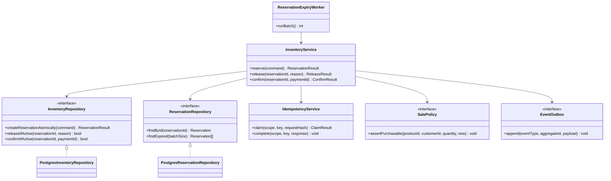
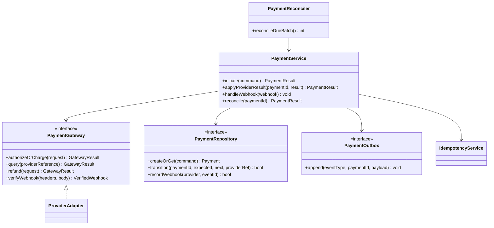
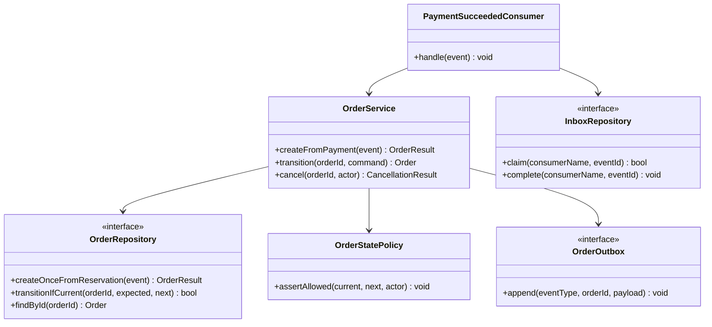

# R. LOW-LEVEL DESIGN

This LLD keeps the critical write path small: PostgreSQL owns stock and transactional state; Redis is an optimization only; Kafka carries durable integration events through a transactional outbox.

## 1. Inventory and Reservation Module

### Responsibilities

- `InventoryService` validates the sale window and request shape, then coordinates reservation creation.
- `InventoryRepository` performs the conditional stock decrement and reservation insert in one database transaction.
- `ReservationRepository` reads and transitions reservations with compare-and-set predicates.
- `IdempotencyService` returns the prior result for a repeated customer/key/operation tuple.
- `EventOutbox` records `ReservationCreated` or release events in the same transaction as state changes.

### Interfaces and class diagram



`reserve` uses one transaction: claim the idempotency key; execute the conditional decrement; if exactly one row changed, insert the reservation and outbox event; persist the response; commit. A zero-row update means sold out (or invalid stock row), never a read-then-write success. A unique constraint on `(customer_id, idempotency_key)` is the final duplicate guard. The request hash rejects reuse of the same key with a different payload.

For quantity `q`, the decisive SQL is conceptually:

```sql
UPDATE inventory
SET available_quantity = available_quantity - :q,
    reserved_quantity = reserved_quantity + :q,
    version = version + 1,
    updated_at = now()
WHERE product_id = :product_id
  AND available_quantity >= :q;
```

The application checks `row_count = 1` before inserting the reservation. Both updates and reservation/outbox inserts commit or roll back together. A `CHECK (available_quantity >= 0 AND reserved_quantity >= 0 AND sold_quantity >= 0)` is defense in depth, not a replacement for the conditional update.

## 2. Payment Module

### Responsibilities

- `PaymentService` owns payment state transitions and coordinates provider calls.
- `PaymentGateway` is a provider-neutral port; provider adapters map provider responses and webhooks into domain results.
- `PaymentRepository` stores an immutable provider reference, unique merchant reference, amount/currency, state, and provider idempotency key.
- `PaymentWebhookHandler` verifies signatures, deduplicates provider event IDs, and applies legal transitions.
- `PaymentReconciler` queries ambiguous in-flight payments; it does not blindly charge again.



The payment row and `PaymentSucceeded` outbox record are committed atomically after a verified provider success. The gateway call itself cannot participate in the SQL transaction. Therefore a timeout creates `UNKNOWN/PENDING_RECONCILIATION`, and reconciliation queries using the same merchant reference/provider idempotency key. A second charge is forbidden while the result is ambiguous.

## 3. Order Module

### Responsibilities

- `OrderService` creates at most one order per reservation/payment business key and validates transitions.
- `OrderRepository` enforces unique source reservation and compare-and-set state transitions.
- `PaymentSucceededConsumer` uses an inbox/dedup table and commits inbox + order + outbox in one local transaction.
- `OrderOutbox` emits `OrderCreated` / `OrderConfirmed` for fulfilment and notifications.



Use unique constraints on `orders.reservation_id` and `orders.payment_id` (both non-null for paid orders). Consumer transaction: claim event ID; insert order if absent; transition reservation to confirmed/sold according to the agreed stock model; append order event; commit. If the event was already consumed, return success without repeating effects. If the transaction fails, do not commit the Kafka offset; redelivery is safe.

## Transaction Boundaries and Concurrency

1. **Reserve:** idempotency record + conditional inventory decrement + reservation insert + outbox event in one PostgreSQL transaction. Use `READ COMMITTED`; the conditional `UPDATE` obtains a row lock and rechecks its predicate after waiting. For one hot product, requests serialize briefly on that product row. This is intentional: 100 units are the serialization point.
2. **Pay:** persist payment intent before calling the gateway. Never hold a database transaction open across network I/O. Provider call has a bounded timeout and stable idempotency reference.
3. **Payment success:** payment state + outbox event in one transaction.
4. **Consume payment:** inbox claim + unique order insert + order outbox event in one transaction.
5. **Expiry/release:** conditional reservation transition and inventory counter update in the same transaction. Only the worker that changes `ACTIVE` to `EXPIRED` may increment available stock.

No distributed SQL transaction spans services. Cross-service work is a saga with durable events, idempotent steps, and compensation. Compensation is a business action (release stock or refund), not a rollback of history.

## Operational Notes

- Apply bounded statement and lock timeouts; overload should reject/queue at the edge rather than let request threads pile up behind the hot row.
- Retry serialization/deadlock/transient failures with bounded exponential backoff and jitter, preserving the same idempotency key. Do not retry a sold-out result.
- Partition reservation and idempotency tables by time only after measured growth warrants it; keep unique business keys enforceable (or route each key to a deterministic shard).
- Keep the inventory write primary authoritative. Read replicas, caches, and search indexes may show stale availability but cannot grant stock.
- Emit audit history for transitions with actor, reason, timestamp, correlation ID, and prior/new states; redact payment credentials and sensitive personal data.