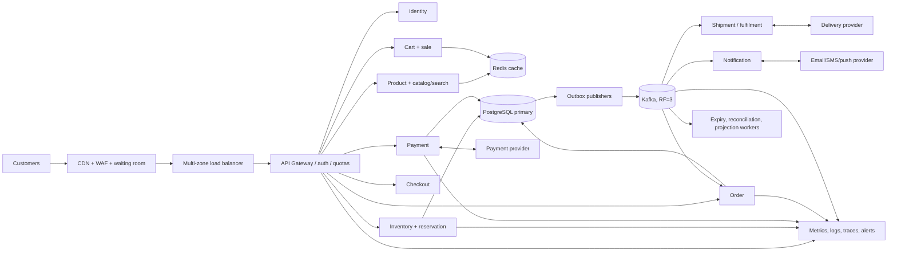
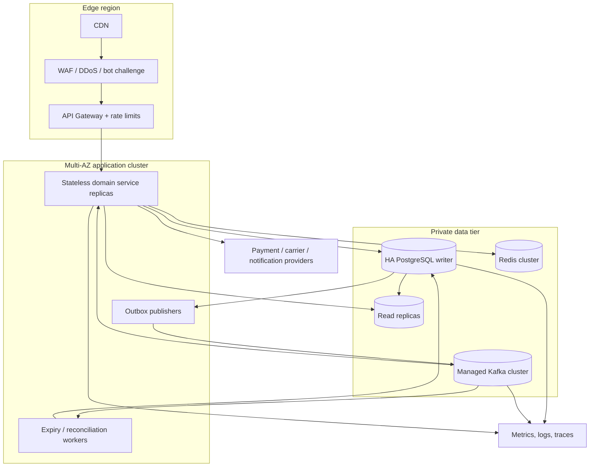

# AC. FINAL RECOMMENDED ARCHITECTURE

## One Coherent Recommendation

Use domain-oriented services with PostgreSQL as the transactional source of truth for inventory/reservations, payments, and orders; Redis only for safe read optimization/rate limiting; managed Kafka for durable integration events; and an outbox/inbox plus idempotent consumers for recoverable asynchronous workflows. The inventory primary's conditional SQL update is the only stock allocation authority.

## End-to-End Request Flow

1. Customer discovers a cached product/sale page. Displayed stock is informational, not a promise.
2. Authenticated request passes WAF, signed sale-token/eligibility checks, quotas, and idempotency validation.
3. Reservation service starts a short SQL transaction: claim idempotency key; conditionally decrement available and increment reserved if enough stock; insert reservation and outbox; save response; commit. One affected row means success; zero means sold out.
4. Checkout validates price/coupon/sale eligibility and persists an immutable quote. Payment service persists one payment intent with a stable merchant reference, then calls the provider outside a DB transaction.
5. Definitive success/failure is persisted with an outbox event. Ambiguous timeout stays `UNKNOWN` and is reconciled by provider query/webhook using the same reference; never issue a second charge.
6. Payment success event is delivered at least once. Order consumer's inbox, unique reservation/payment constraints, order row, and order outbox are committed in one local transaction.
7. Order confirmation drives fulfilment/shipment asynchronously. Provider tracking events advance order state; notification delivery is independently retried.
8. Failure/timeout release transitions an active reservation and adjusts counters atomically. Expiry workers use conditional state transitions, so duplicate workers cannot restore stock twice.

## Final Decisions

| Concern | Decision |
|---|---|
| Services | Product/catalog, cart/sale, inventory/reservation, checkout, payment, order, shipment/fulfilment, notification, identity; deploy independently where traffic/ownership justifies it |
| Database | PostgreSQL-compatible SQL primary for authoritative transactional data; read replicas for lag-tolerant reads; one product's inventory belongs to one authoritative shard |
| Inventory concurrency | Atomic conditional `UPDATE ... WHERE available_quantity >= quantity`; check affected-row count; reservation/counters/idempotency/outbox in same transaction |
| Reservation | Durable state machine with expiry, unique idempotency key, atomic release/confirm, audit history |
| Cache | Redis/CDN for catalog, sale metadata, sessions and rate limits; never grant stock from cache |
| Broker | Managed Kafka, RF=3, `acks=all`, retention/replay, partition by aggregate key; outbox/inbox and idempotent consumer effects |
| Payment | Durable intent + unique merchant/provider key; bounded timeout/circuit breaker; webhook and reconciliation; do not re-charge unknown outcomes |
| Order | Explicit legal state transitions; one order per reservation/payment; payment success recorded before asynchronous order projection |
| Recovery | Transactional outbox, consumer inbox, bounded retries, DLQ with replay, payment/order reconciliation, compensating release/refund |
| Scalability | CDN and admission control absorb/read-shape burst; horizontal stateless services; bounded DB pools; independently scaled consumers; shard only after measurement |
| Security | OIDC, object authorization, TLS/mTLS, WAF/bot controls, scoped sale tokens, provider tokenization, secret manager, redacted audit |
| Observability | Correlated trace/request/event IDs, SLO dashboards, inventory/payment/order reconciliation metrics, queue-age alerts |

## Failure Guarantees and Trade-offs

- If the authoritative database is unavailable or its commit outcome is unknown, reservation does not succeed based on Redis. Return retryable/unknown status and let the same idempotency key resolve the result after recovery.
- If Kafka is unavailable after a service transaction commits, the event remains in that service's outbox and publishes later. Local business data is not rolled back.
- If Order Service is down, Payment Service has already durably recorded success and the outbox retains the event. The order is eventually created once; reconciliation detects gaps.
- If the provider times out, money outcome is unknown. Query by stable reference or await signed webhook; do not create a new payment.
- The design chooses correctness and recoverability over pretending every interaction is synchronous or exactly once. The hot inventory row is a deliberate per-product throughput limit; the waiting room/backpressure protects it.

## Final Architecture Diagram (System Deployment Shape)

This is the final baseline; adapt cloud products and deployment topology without weakening the transactional stock rule, idempotency scope, or payment reconciliation behavior.
